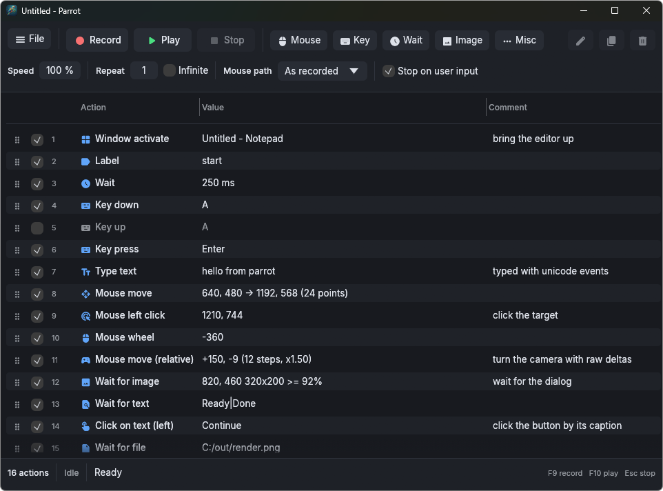
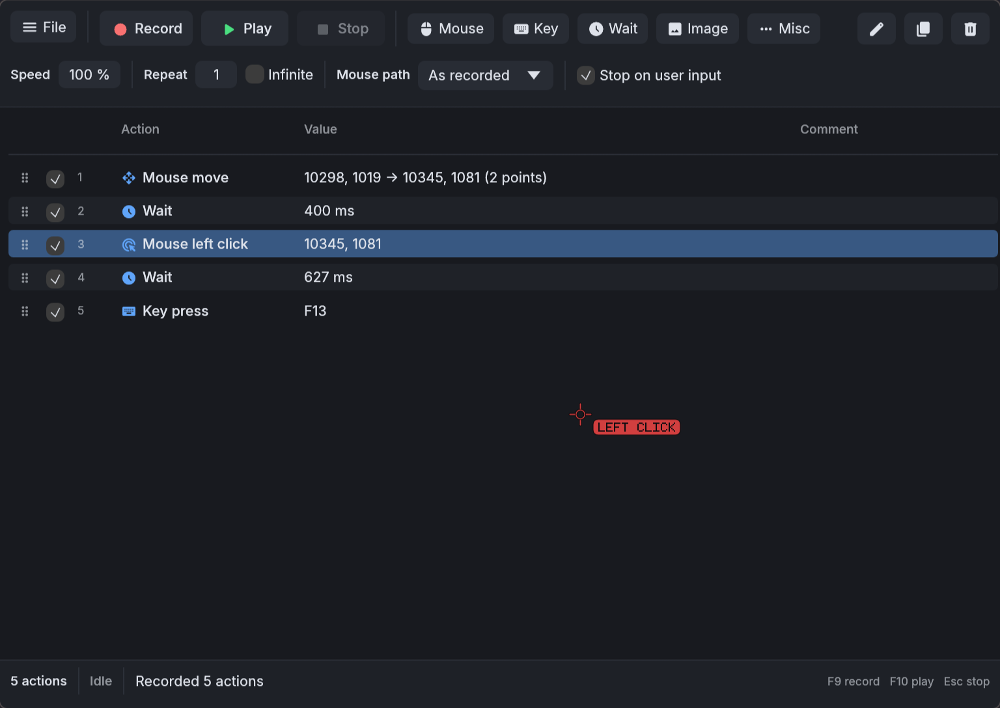

# Macro Recorder

A small desktop macro recorder for Windows and Linux (Wayland, Hyprland), written in Rust with egui. Record keyboard and mouse input, edit the resulting action list, and replay it into games and desktop apps. Built for personal automation: sandbox games and repetitive workflows.



## Features

- [x] Record keyboard, mouse and window changes into editable actions
- [x] Replay with speed factor, repeat count or infinite loop
- [x] Auto-stop when you press a key or mouse button during playback
- [x] Global hotkeys (F9 record, F10 play, Esc stop, all configurable)
- [x] Drag to reorder, double-click to edit, comments per action
- [x] Scan-code key injection so DirectInput games see the keys
- [x] Relative mouse moves for raw-input games
- [x] Wait for an image region to match, with a screen region picker
- [x] Wait for text and click on text via OCR (Windows.Media.Ocr or tesseract), substring or regex
- [x] Wait for a file to appear, with wildcards
- [x] Window activation by title and process name
- [x] On-screen overlay showing where the selected action acts
- [x] JSON macro files, hand-editable, opened from the command line
- [x] Elevation warning and restart as administrator (Windows)
- [x] Linux backend for Hyprland: evdev recording, virtual pointer and keyboard, wlr-screencopy, layer-shell overlay (see [docs/porting-linux.md](docs/porting-linux.md))
- [ ] Variables and conditional branches
- [ ] Image search click, like click on text but for a template

## Build and run

```
cargo run --release
cargo run --release -- path/to/macro.json
```

Requires Rust 1.95 or newer. On Windows the build embeds a per-monitor DPI manifest so coordinates are physical pixels everywhere.



On Linux the build links against the system tesseract, leptonica and libxkbcommon (Arch: `pacman -S tesseract tesseract-data-eng leptonica libxkbcommon clang`, clang for the generated bindings). Recording reads `/dev/input`, so the user must be in the `input` group. Cursor positions, window activation and global hotkeys use the Hyprland IPC socket; on other Wayland compositors playback, capture and the overlay still work but those three do not. Macro files are portable between the platforms: keys are stored by position (scan code) plus the Windows virtual-key code, and screen coordinates are physical pixels.

## Layout

- `src/model` shared action model, macro file format, settings
- `src/platform` platform traits, mocks, the portable overlay renderer, the Win32 implementation (hooks, injector, capture, overlay, OCR) and the Linux implementation (evdev, Hyprland IPC, Wayland protocols, tesseract)
- `src/engine` recorder, player, scheduler, image and text matching
- `src/ui` egui application
- `examples/` small binaries for smoke testing hooks, injection, OCR and the overlay
- `scripts/screenshot.ps1` and `scripts/screenshot.sh` launch the app and capture its window (Windows, Hyprland)

## Development

```
cargo fmt
cargo clippy --all-targets -- -D warnings
cargo test
```

Set `MACRO_FAKE_ENGINE=1` to run the GUI against a scripted engine and `MACRO_DEMO_DOC=1` to preload a macro with one action of every kind. `MACRO_OVERLAY_CAPTURABLE=1` keeps the overlay visible to screen capture for manual checks, and `MACRO_OCR_LANG` picks the tesseract languages on Linux (for example `deu+eng`).

From Linux, `cargo check --target x86_64-pc-windows-gnu --all-targets` type-checks the Windows side after `rustup target add x86_64-pc-windows-gnu`.
